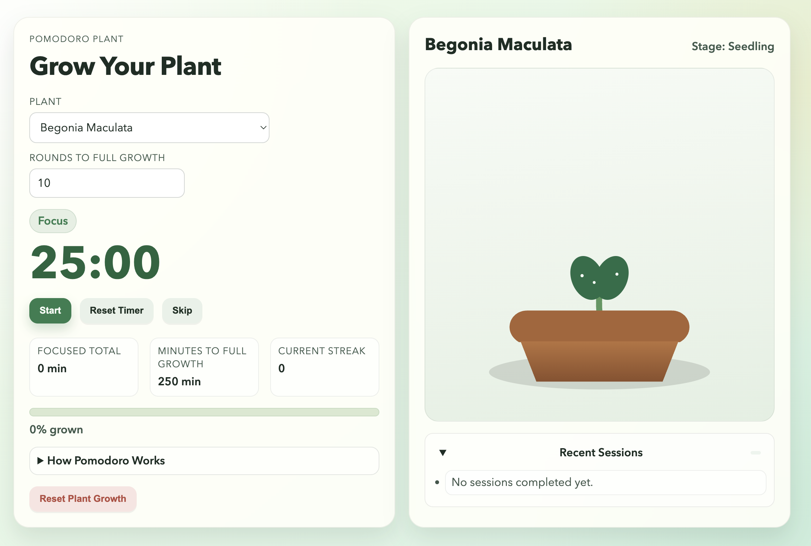

# Pomodoro Plant

Grow a virtual plant while staying focused with the Pomodoro technique.

[](https://github.com/alissadb/pomodoro-plant/actions/workflows/deploy.yml)
[](https://github.com/alissadb/pomodoro-plant/releases/latest)
[](LICENSE)

**[Pomodoro Plant](https://alissadb.github.io/pomodoro-plant/)**

## Screenshot



*Focus timer and growing plant side-by-side view*

## Features

- 🍅 **Pomodoro Timer**: 25-min focus sessions, 5-min short breaks, 15-min long breaks (every 4th cycle)
- 🌱 **Plant Growth**: Choose from 3 plants (Snake Plant, ZZ Plant, Begonia) with 5 visual growth stages
- 🎯 **Customizable Goals**: Adjustable growth goal (default: 10 rounds = 250 minutes)
- 📱 **Mobile Optimized**: Floating plant preview button, sticky controls, touch-friendly interface
- 🔔 **Notifications**: Browser notifications + sound chimes when sessions complete
- 💾 **Offline Support**: Installable PWA with local data persistence
- 📊 **Session History**: Track completed focus sessions and streaks

## Technology Stack

- **Frontend**: Vanilla JavaScript (ES6 modules), HTML5, CSS3
- **Architecture**: Modular design with pure domain logic separated from UI
- **Testing**: Node.js native test runner (28 automated tests)
- **PWA**: Service Worker with offline caching
- **Storage**: localStorage with debounced persistence
- **Build**: No build step, no bundler, zero dependencies

## Quick Start

### Run Locally

```bash
# Start development server
python -m http.server 8000

# Or using Make
make serve

# Open in browser
open http://localhost:8000
```

### Install as PWA

**iOS:**
1. Open http://localhost:8000 in Safari
2. Tap Share button → "Add to Home Screen"
3. Launch from home screen like a native app

**Android:**
1. Open http://localhost:8000 in Chrome
2. Tap Menu (⋮) → "Install app"
3. Launch from app drawer

### Run Tests

```bash
# Run all tests
npm test

# Run tests in watch mode (if configured)
npm run test:watch
```

## Development

```
src/
├── app.js              # App orchestration (UI + module wiring)
├── pomodoro-core.js    # Pure domain functions (modes, stages, goals)
├── app-state-core.js   # State transitions + sanitization
├── timer-controller.js # Timer loop lifecycle (start/stop/tick)
├── state-storage.js    # localStorage adapter (debounced/immediate save)
├── notifications.js    # Browser notifications + completion chime
├── plant-renderer.js   # Plant SVG rendering (snake, zz, begonia, fallback)
└── styles/
    └── styles.css      # Design system + visual styling

tests/                  # 28 automated tests
```

## Architecture Notes

- `app.js` coordinates modules and DOM events, but keeps business rules in core/state modules.
- `pomodoro-core.js` and `app-state-core.js` remain framework-agnostic and easy to unit test.
- Rendering, timer, notifications, and persistence are isolated behind dedicated modules to keep the codebase KISS, SOLID, and DRY.

## Contributing

See [CONTRIBUTING.md](CONTRIBUTING.md) for contribution guidelines.
